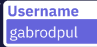
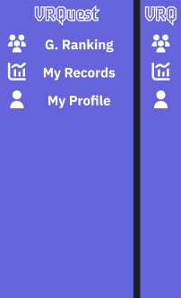

##  Introduction
This a simple VR game in which you control a little spaceship, moving it around with your hand, shooting at asteroids and getting new high scores. After creating an account, you'll be able to play the game, upload your records and use the web to customize your profile, see your stats and the global ranking.

The web and the game are still a Work In Progress.

The game is being developed for our tutor at AIJU, a company that develops toys and games.
***
## Diagrams and Data Model
### ER diagram: 

### UML diagram: 

### Entity diagram:

### Data Model
The data model can be summed up like this:
* Player: People who play the game & access the web, etc. A more appropioate name could have been "User"
  - pid: The player's ID.
  - username: The player's Username.
  - password: The player's Password. Encrypted.
  - isAdmin: Boolean value to determine if some player will be granted admin permissions in the web.

* Settings: A player's settings that have to be loaded in-game.
  - sid: Settings's entry ID.
  - playerId: The player's ID.
  - volumePercentage: Integer whose values are clamped between 0 and 100 and represents the volume percentage.

* Record: The records a player saves in-game. They can be later seen through the web.
  - rid: Record ID.
  - playerID: The player's ID.
  - Score: The total score a player has achieved.
  - PowerUps: Total nº of power-ups collected.
  - Time: Time in seconds the game lasted.

A player has its records and settings saved in the database and may access a global ranking.
***

## User requirements
### R1. Platform
* R1.1. Unity VR game
* R1.2. Web that display data about the players' records.

### R2. Users must be logged in to have access to the web and the game.

### R3. Administrators have full CRUD access.
* R3.1. They can view and manage all players.
* R3.2. They can view and manage all records.
* R3.3. They can view and manage all settings.

### R4. Registered players can play the game.
* R4.1. They login from the Unity game.
* R4.2. They play the game, moving the spaceship around and shooting and avoiding asteroids.
* R4.3. After a certain number of asteroids are destroyed, the player jumps into another screen to keep destroying more asteroids.
* R4.4. Repeat 2 and 3 until the ship is destroyed or the player quits.
* R4.5. The player uploads the results to the database.

### R5. Players have their own profile.
* R5.1. They can play the game and upload their records.
* R5.2. They can update your profile and delete your account.
* R5.3. They can view all their records.
* R5.4. They can access to the global ranking.

***
##	Use Cases
### Use Cases diagram:

Players are able to play the game and upload their records, check them and the global ranking, and manage their profile. To do this, they first need to log in or create an account if they don't have one.

Admins can manage their profile, have full CRUD access and manage databases. They also need to log in.

##	Interfaces:
###	Initial design: Mockups & prototyping
[Web prototype in Figma](https://www.figma.com/file/7pwADTtVlbOPdLFdYE4cEP/VRQuest?t=1ZlHt4fvG38oy8s5-1)

### WIP:	Usability
#### Colors

This is the main color palette I've choosen. It is mainly compose of pastel, cold colors as a way to represent the coldness of space, but in a more soft, fun way, bringing personality to the whole interface.
* Space cadet is used as the background color. A really dark blue/magenta/violet, that contrasts and complements the rest of the palette.
* Slate blue is used as a background for the different parts of the UI.
* White is used as a foreground and as the little stars in the background, providing contrast.
* Roman is used to display errors.

### Fonts
For the fonts, the game and web use "Iceberg" for the logo and title. It evokes a futuristic, cybernetic feeling which fits perfectly the concept of travelling across space.

The rest of the text uses IBM Plex Sans Thai Looped, regular and bold. Nice and appealing to the eyes. 

### Navigation
To navigate to the different sections, I've choosen a side-burguer-menu that can be closed to allow for the rest of the elements in the page to have more space.
This makes it easy to adapt to devices with different sizes and easy to navigate the web page.
The icons are self-descriptive and have text next to them to further explain what that section is for.

### The game
The game is played with a VR headset and one of two controllers. 

Basically, you pick a little spaceship, and it follows your controller's movements. 

Then, asteroids start comming for you from the front, and the direction in which they come is always the same. This was done to keep head movements at minimun, for a less dizzier experience. 

You destroy asteroids by shooting little proyectiles at them, and gain points. After a certain amount of asteroids are destroyed, you change scene and start again until your ship runs out of energy (3 hits) or you quit.

***
##	Manuals
### Installation manual for the developer (both server & client)
In the [README](https://github.com/GabRodPul/VRQuest/blob/main/README.md).
###	Installation manual for technicians who'll install the app for the client
*TODO I guess*

###	User manual
*TODO*
###	User help inside the app
*TODO*
***
##	Technology stack
### Main technologies:
#### Various:
* [NodeJS](https://nodejs.org/): The JS runtime. Used in both backend & frontend.

#### Backend:
* [MySQL](https://www.mysql.com): The database
* [Express](https://expressjs.com): The API
* [Prisma](https://www.prisma.io): The ORM

#### The game:
* [Unity](https://unity.com): The game engine.

#### Web frontend:
* [React](https://reactjs.org): The web framework

### Libraries & others
Various:
* [TypeScript](https://www.typescriptlang.org): A typing system for JavaScript.

#### Backend:
* [bcrypt](https://www.npmjs.com/package/bcrypt) and its [respective types](https://www.npmjs.com/package/@types/bcrypt): To encrypt passwords and verify them.
* [jsonwebtoken](https://www.npmjs.com/package/jsonwebtoken): Used to handle JWT's.
* [cors](https://www.npmjs.com/package/cors) and its [respective types](https://www.npmjs.com/package/@types/cors): CORS Middleware
* [Express types](https://www.npmjs.com/package/@types/express)

#### The game:
* [Unity XR Input](https://docs.unity3d.com/Manual/xr_input.html): Handles VR input.
* [UnityWebRequest](https://docs.unity3d.com/ScriptReference/Networking.UnityWebRequest.html): To communicate with the API
* [Unity's JsonUtility](https://docs.unity3d.com/2020.1/Documentation/ScriptReference/JsonUtility.html): To parse data structures back and forth between the game and the database.
* TODO: List assets

#### Web frontend:
* Several React libraries:
  - [React](https://www.npmjs.com/package/react) and its [respective types](https://www.npmjs.com/package/@types/react)
  - [React DOM](https://www.npmjs.com/package/react-dom) and its [respective types](https://www.npmjs.com/package/@types/react-dom)
  - [React Router](https://www.npmjs.com/package/react-router)
  - [React Router DOM](https://www.npmjs.com/package/react-router-dom)
  - [React Bootstrap](https://www.npmjs.com/package/react-bootstrap)
  
* [ViteJS](https://vitejs.dev): A fast JS dev enviroment

* [Sass](https://sass-lang.com): Better CSS
***

## Technology comparison
### The type of app
The game and the web are basically a multiplatform app.

### Backend
* I used MySQL as the database, since it's the SQL dialect I'm the most experienced with, and its pretty simple. The other main SQL dialect used is PostgreSQL, and the main difference its that they are purely relational and object-relational respectively. Furthermore, PostgreSQL also offers more sophisticated datatypes and allows for inheritance.
* Express its the backend framework of choice for this project. It's built on top of Node.JS and manages routes, middleware, etc, ensuring that performance is not compromised. It's the king of Node backend frameworks and easy to learn. Other alternatives to Express include:
  - Koa, which was made by the same team as Express and its more customizable (it comes without any bundled middleware, etc).
  - Fastify, which is focused on providing the best DX (developer experience) possible with the least overhead and a powerful plugin architecture. It's around 20% faster than Express.

* Prisma its the ORM. We were initially assigned Sequelize, but I was allowed to try this instead. Sequelize allows you to easily describe the models corresponding to your database using Type/JavaScript. The thing is, if you happen to make any changes to the database for whatever reason, you will need to update your Sequelize code. Prisma solves this by, given a .prisma file, in which you define the tables and models for your database, Prisma then generates not only the appropiate models and operations for each of them, but also updates the models in the database itself, unifying both and making everything easier and safer.

### The game
The game was made with Unity. Given how easy it is to learn for beginners while still providing powerful functionalities that can help you make great games, it's the most famous game engine out there. It also features an ecosystem of assets that can be acquired at the Unity Asset Store (some of them for free) that allows game devs to start building games.

There are a lot of libraries and engines out there for making games, but the only one to really compete with Unity in terms of popularity and usage as of now, is Unreal Engine:
  - Unity is targeted more torwards indie and hobby developers, and Unreal is more used within AAA game devs.
  - Unity is easier to use and uses C#, while Unreal is harder and uses C++.
  - Unity is not open source, and the basic version is free, but commercial licenses have a price. Unreal on the other hand, while still free, makes devs pay a % of their sales to Unreal.
  - Unity has more built-in features than Unreal.
  - Unreal is more performant and allows for more advanced AI, graphics, etc.

Other famous game engines worth mentioning are:
* GameMaker Studio, which is famous for its ease-of-use and mainly used for 2D games, more specifically, fangames of existing franchises. Still, nowadays, it isn't as used as it used to be.
* Godot is even easier to use than Unity, as it provides an easier entrypoint for non-programmers with its built-in programming language, and still supports both C++ and C#. You can build 2D and 3D games and you mainly need to worry about making assets.

### Web frontend
We weren't really told to use any specific web frameworks, so I decided to stick with ReactJS. The other choice would be Angular. The main differences between the two are that:
* React is a library, while Angular is a complete framework.
* React is more straightforward, lighter and faster than Angular.
* React combines both the structure (HTML) and the code (JS/TS) together, while Angular divides its pages and components in different files.
* React takes a bit more time to set up, but allows you to build apps and projects really fast. Angular takes less time to set up, but coding takes longer.
* Angular is better suited for bigger teams.

For these reasons, I feel like React is the right tool for this job, and while Angular would have allowed me to reuse *some* existing code, I feel like it would be worse not only for me, but for the application as a whole if I used it instead of React.

***
##	Repositories
Only [one](https://github.com/GabRodPul/VRQuest), with 3 branches:
* main
* develop
* feature
***

##	Planification
Done with GitHub's project manager. It can be found [here](https://github.com/GabRodPul/VRQuest/projects).
***

##	Conclusions, opinions, reflexions
### 19/12/2022
At the time of writing this, I don't really have much of the project finished, aside from the backend. Reason is, not only I didn't really had what I wanted to do clear until a 2 or 3 weeks in, but then, even after having the prototypes done, I spent a lot of time trying to have some mechanics and other Unity stuff working, while not really having the backend fully fledged, nor the final game mechanics in mind.

Also, I only started working on the web about 4 days before the deadline, and while choosing Angular over React would have allowed me to copy and paste some existing code I have, there wouldn't be much difference in the end result, and in fact I'd say it would be even worse in some way, especially in the long run after this.

In conclusion, the complexity that comes with developing a game and the lack of proper planning from my standpoint have been what caused this project to not meet the proper criteria before the deadline. But I'll make it in the end!
***

##	Links & references
